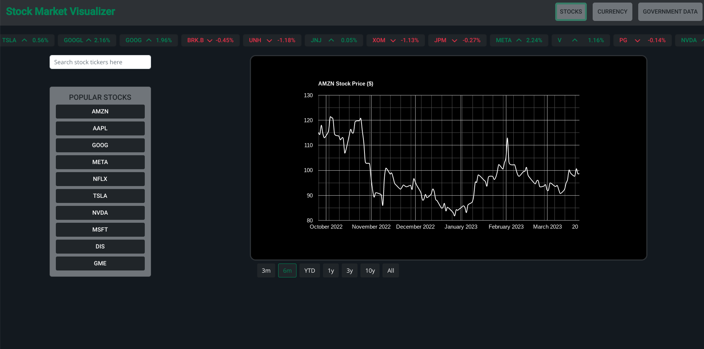

# Stock Visualizer

## Description

My Stock Market Visualizer group project from bootcamp, but revamped with React and other npm libraries. A data visualization SPA that shows historical data for popular stocks, currency exchange rates, and US government data

## Deployed App

[Deployed App](https://jason-lieb.github.io/Stock-Visualizer/)



## Technologies

- React
- React Query
- React Bootstrap
- React Google Charts
- Vite
- Javascript
- HTML
- CSS

## Installation

To install necessary dependencies, run the following command:

```
npm i
```

## Usage

To run locally, run the following command:

```
npm run dev
```

## Questions

If you have any questions about the repo, open an issue or contact me directly at jason.lieb@outlook.com. You can find more of my work at [github](https://github.com/jason-lieb/).
